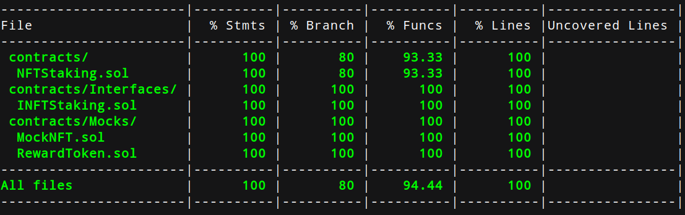

# 🎨 NFT Staking Contract

---

## 📜 Overview

This smart contract, `NftStaking`, is designed to allow users to stake their NFTs (Non-Fungible Tokens) and earn rewards in the form of ERC20 tokens. The contract is upgradeable, uses OpenZeppelin libraries, and implements several security features such as reentrancy guards and pausability.

## ✨ Features

- NFT staking and unstaking
- Configurable reward rates per NFT pool
- Customizable unbonding periods and claim buffers
- ERC20 token rewards
- Upgradeable contract structure
- Pausable functionality for emergency situations
- Owner-controlled pool management

## 🏗️ Contract Structure

The `NftStaking` contract inherits from several OpenZeppelin contracts:

- `UUPSUpgradeable`: For upgradeability
- `IERC721Receiver`: To receive ERC721 tokens
- `Ownable2StepUpgradeable`: For ownership management
- `ReentrancyGuardUpgradeable`: To prevent reentrancy attacks
- `PausableUpgradeable`: To pause contract functionality if needed

## 🔑 Key Functions

### 🛠️ Initialization

- `initialize(address _admin, address _REWARDTOKEN)`: Initializes the contract with an admin address and the reward token address.

### 🏊 Pool Management

- `addPool(address[], uint256[], uint256[], uint256[])`: Adds new NFT staking pools with specified reward rates, unbonding periods, and claim buffers.
- `updateRewardPerBlock(address _poolAddress, uint256 _rewardAmountPerBlock)`: Updates the reward rate for a specific pool.

### 🔄 Staking Operations

- `deposit(address _pool, uint256 _tokenId)`: Allows users to stake their NFTs.
- `requestWithdraw(address _pool)`: Initiates the withdrawal process for a staked NFT.
- `withdraw(address _pool)`: Completes the withdrawal process after the unbonding period.
- `claimRewards(address _pool, address _to)`: Allows users to claim their accumulated rewards.

### 👀 View Functions

- `isRewardWithdrawable(address _user, address _nftPool)`: Checks if rewards are withdrawable for a user.
- `poolInfo(address nft)`: Retrieves information about a specific NFT pool.
- `userInfo(address pool, address user)`: Retrieves information about a user's stake in a specific pool.

### 🔧 Admin Functions

- `pause()`: Pauses the contract operations.
- `unpause()`: Resumes the contract operations.

## 🔒 Security Features

- Reentrancy Guard: Prevents reentrancy attacks on critical functions.
- Pausability: Allows the owner to pause contract operations in case of emergencies.
- Access Control: Owner-only functions for sensitive operations.
- Safe ERC20 Operations: Uses OpenZeppelin's `SafeERC20` for token transfers.

## 🛠️ Usage

1. Deploy the contract using a proxy pattern compatible with UUPS upgradeability.
2. Initialize the contract with the admin address and reward token address.
3. Add NFT pools using the `addPool` function.
4. Users can then stake their NFTs, request withdrawals, and claim rewards as per the defined rules.

## 🚀 Initial Setup

To initial setup and install all required dependencies, run the following command:

```shell
yarn install
```

## 🔨 Build

To build the contracts, run the following command:

```shell
yarn run build
```

## 🧪 Testing

To test the NFTStaking contract on a local node, run the following command:

```shell
yarn run test
```

To get the test coverage, run the following command:

```shell
yarn run coverage
```

### Current test coverage report



## 📦 Deployment

To deploy the NFTStaking contract on a testnet, meet these pre-requisites:
**Configure the environment variable in .env files:**

**OWNER_PVT_KEY**: Deployer private key
**ALCHEMY_NODE_KEY**: Node API for Alchemy as provider
**ARBITRUM_API_KEY**: Arbiscan API key to verify the contract
**REWARD_TOKEN**: An ERC20 compliant token to be used as a reward token for staking rewards

**Run the below command to deploy the NFTStaking contract on the currently configured testnet (Arbitrum-Sepolia):**

```shell
yarn run deploy-arbSepolia
```

## 🌐 Current Deployment on Arbitrum-Sepolia

**NFTStaking contract** (UUPS Proxy Pattern): [0xe841B5F4167a0E953d1351E6A513158320439469](https://sepolia.arbiscan.io/address/0xe841B5F4167a0E953d1351E6A513158320439469#code)
**Implementation contract [Old Implementation]**: [0x2D604128F510F2E39B6e7B04e3AD3923f947cEdA](https://sepolia.arbiscan.io/address/0x2D604128F510F2E39B6e7B04e3AD3923f947cEdA#code)

**NFTStaking contract upgraded to new implementation**: [0x7F9BD0BE298Ce389E1449Dc172A53d20d9103DF2](https://sepolia.arbiscan.io/address/0x7f9bd0be298ce389e1449dc172a53d20d9103df2#code)

**Reward Token**: [0x8fD2D8E15BE120C161533E3466Afe654758214d3](https://sepolia.arbiscan.io/address/0x8fD2D8E15BE120C161533E3466Afe654758214d3#code)

**Owner**: [0x41E75739F01D487Dd503D41c8e9Beb0e0EaBb528](https://sepolia.arbiscan.io/address/0x41E75739F01D487Dd503D41c8e9Beb0e0EaBb528)

---
